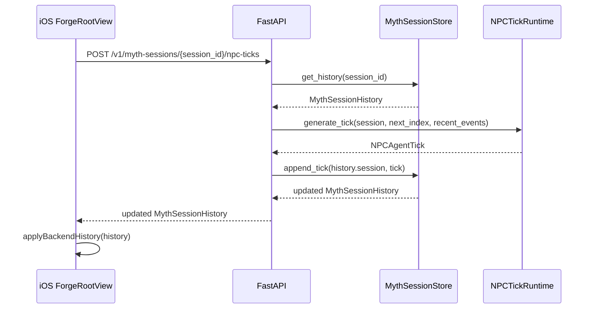

# P0.29 Server-Owned NPC Advance Design

## Context

P0.27 added backend-owned local myth session history. P0.28 connected that
history to the iOS restore flow. The remaining NPC loop still has a weak
handoff: the mobile app advances the village by sending the whole `MythSession`
to `POST /v1/npc-ticks`, then locally appends the returned tick. That works for
a stateless demo, but it does not move the product toward a server-owned AI
Agent village where NPC continuity is recovered from backend history.

P0.29 makes the backend the primary owner of NPC advancement for stored demo
sessions while keeping the existing stateless endpoint as a compatibility
fallback.

## Goal

Add a server-owned NPC advance path that loads a saved myth session, derives the
next tick from stored history, appends it to backend history, and lets the iOS
app refresh its visible demo state from the returned history.

## Non-Goals

- No background autonomous loop. The first path is still user-triggered by the
  existing `Advance Village` button.
- No production account memory or cross-device identity model.
- No raw personal-source storage. The endpoint uses only approved myth session
  fields and stored structured tick summaries.
- No live provider-key requirement. `NPC_PROVIDER=openai` remains optional and
  backend-only.
- No Unity movement execution, voice NPC, or print fulfillment change.

## Approaches Considered

### Recommended: Session-Scoped Advance Endpoint

Add:

```http
POST /v1/myth-sessions/{session_id}/npc-ticks
```

The backend validates the session id, loads `MythSessionHistory`, computes the
next tick index from stored ticks, uses the latest stored tick or initial world
resolution as recent events, runs the configured NPC tick runtime, appends the
tick, and returns the updated `MythSessionHistory`.

This is the best next step because it directly uses the history contract built
in P0.27/P0.28 and makes the mobile client less authoritative about NPC memory.

### Alternative: Keep Stateless Endpoint And Only Sync Afterward

The app could keep calling `POST /v1/npc-ticks`, then call `GET /history`.
This preserves the current surface but still trusts the client to supply the
session and tick index. It is less useful for the final AI Agent architecture.

### Alternative: Add Background Scheduler Now

The backend could tick sessions on a timer. That would look autonomous, but it
adds scheduling, lifecycle, and concurrency behavior before the session-scoped
advance contract is stable. It is too much for this iteration.

## API Contract

`POST /v1/myth-sessions/{session_id}/npc-ticks`

Request body: none.

Responses:

- `200 MythSessionHistory`: updated stored session history.
- `404`: session id is valid but not found.
- `422`: malformed session id path validation.
- `502`: provider failure, sanitized to avoid provider keys, raw media, and
  private data leakage.

The endpoint is idempotency-neutral: each successful call advances one tick.
The next tick index is:

```text
max(existing npc_ticks.tick_index, default 0) + 1
```

Recent events are derived by the backend:

- latest stored tick `world_resolution.visible_changes`, if any
- otherwise initial session `world_resolution.visible_changes`

The store keeps its existing bounded tick cap.

## Backend Components

`services/backend/src/myth_forge_api/main.py`

- Add the session-scoped endpoint.
- Use `build_myth_session_store()` to load and append history.
- Use `build_npc_tick_runtime()` so local and OpenAI runtime selection stays
  unchanged.
- Convert provider and validation failures to existing sanitized HTTP errors.

`services/backend/src/myth_forge_api/providers/session_store.py`

- Add a small helper to append a generated tick to existing history. The current
  `append_tick(session, tick)` is sufficient for writing. The endpoint can use
  `get_history(session_id)` first, then pass `history.session` to `append_tick`.

No storage format change is required.

## Mobile Components

`apps/mobile/ios/Sources/PersonalMythForgeMobileCore/PersonalMythForgeAPIClient.swift`

- Add `advanceMythSessionHistory(sessionId:) async throws -> MythSessionHistory`.
- Validate the session id with `MythSessionID`.
- POST to `/v1/myth-sessions/{session_id}/npc-ticks`.

`apps/mobile/ios/App/ForgeRootView.swift`

- Update `advanceNPCTick()` to prefer the server-owned endpoint for valid
  `myth_<16 hex>` session ids.
- On success, call the existing `applyBackendHistory(_:)` path so ready state,
  NPC tick history, and local snapshot stay consistent.
- If the session id is legacy or invalid, keep the existing stateless fallback.
- If the server-owned endpoint fails, show a compact NPC tick error. The demo
  should keep the existing session visible.

`apps/mobile/ios/Sources/PersonalMythForgeMobileProjectChecks/main.swift`

- Add source checks for the new client method and app preference path.

## Data Flow



## Error Handling

- Missing history returns `404` and does not create a new session.
- Provider errors use `_safe_provider_error`.
- Mobile keeps the current visible session/ticks if advance fails.
- Mobile does not expose raw server error text in the main UI.

## Security And Privacy

- No provider keys are sent to mobile.
- No raw media, data URI, local file path, email/chat/calendar body, or raw
  personal-source text is added to the request or stored snapshot.
- Stored history continues to pass through session-store sanitization.

## Testing

Backend tests:

- Creating a myth session then calling the session-scoped advance endpoint
  returns history with one stored tick.
- Calling the endpoint twice returns tick indexes `1` then `2`.
- The endpoint derives recent events from the latest stored tick on the second
  call.
- Unknown valid session id returns `404`.
- Provider failure response is sanitized.

Mobile tests/checks:

- API client builds `POST /v1/myth-sessions/{session_id}/npc-ticks` and decodes
  `MythSessionHistory`.
- Invalid session ids fail before network transport.
- Project checks assert `ForgeRootView` uses the server-owned path and
  `applyBackendHistory`.

Visual regression:

- Add a static 390x844 P0.29 evidence page showing the server-owned advance
  loop, updated tick count, fallback behavior, and backend-only key boundary.

## Acceptance Criteria

- `POST /v1/myth-sessions/{session_id}/npc-ticks` advances stored history without
  requiring the client to send a full session.
- The iOS app prefers the session-scoped endpoint for backend-valid sessions.
- Existing stateless `POST /v1/npc-ticks` remains available.
- Full backend tests, mobile SwiftPM contract tests, app compile gate, and visual
  evidence pass.
- Expected local deployment blockers remain documented: project-local signing
  config and Apple SDK license.
