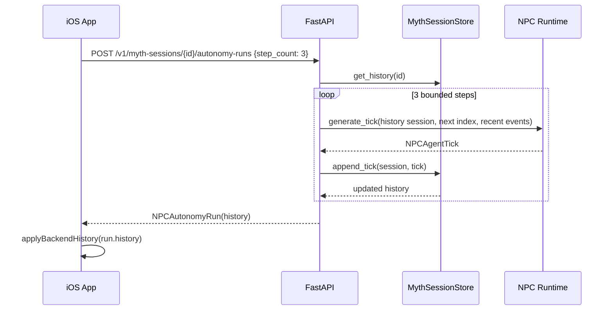

# P0.30 Bounded Autonomous NPC Run Design

## Context

P0.29 made backend history the primary owner of NPC advancement. The iOS app can
ask the backend to advance one tick for a stored myth session, and then apply
the returned history. This is a better server-owned contract, but the player
still experiences NPC agency as one manual step at a time.

P0.30 adds a bounded autonomous run: a single request asks the backend to
advance a stored session for a small number of steps, using the latest stored
history between steps. This moves the demo closer to an AI Agent village loop
without adding a background daemon, scheduler, push notifications, or account
memory.

## Goal

Add a user-triggered, bounded NPC autonomy run that advances a stored myth
session by 1-3 ticks, appends those ticks to backend history, returns a compact
run summary plus updated history, and exposes the action in the iOS demo.

## Non-Goals

- No background ticking service or timer.
- No production account memory, cross-device identity, or server push.
- No Unity movement execution.
- No voice NPCs.
- No provider-key change. OpenAI remains optional, backend-only, and selected by
  existing `NPC_PROVIDER=openai`.
- No raw personal-source, raw media, data URI, or local path storage.

## Approaches Considered

### Recommended: Request-Scoped Autonomy Run

Add:

```http
POST /v1/myth-sessions/{session_id}/autonomy-runs
```

Request body:

```json
{ "step_count": 3 }
```

The backend clamps and validates `step_count` to 1-3, loads stored history,
loops through the configured NPC tick runtime, appends each tick, and returns:

```json
{
  "session_id": "myth_...",
  "requested_steps": 3,
  "completed_steps": 3,
  "started_tick_index": 1,
  "completed_tick_index": 3,
  "agent_runtime": "local_tick_runtime",
  "history": { "...": "updated MythSessionHistory" }
}
```

This keeps autonomy bounded, observable, and easy to test. It also uses the same
runtime provider switch as single-step NPC advancement.

### Alternative: Backend Background Loop

A scheduler could tick stored sessions every N seconds. This better resembles
autonomy, but it introduces process lifecycle, concurrency, storage locking,
push/poll behavior, and runaway-cost controls before the demo has real device
validation. It is too large for this iteration.

### Alternative: Mobile Timer Around Single-Step Endpoint

The app could call the P0.29 single-step endpoint multiple times with a timer.
This gives a visible loop but puts orchestration back on the client. It is less
aligned with server-owned AI Agent behavior.

## API Contract

`POST /v1/myth-sessions/{session_id}/autonomy-runs`

Request model:

- `step_count`: integer, default `3`, minimum `1`, maximum `3`

Responses:

- `200 NPCAutonomyRun`: run summary and updated history.
- `404`: stored myth session not found.
- `422`: invalid path or invalid `step_count`.
- `502`: provider failure, sanitized.

The endpoint advances sequentially. Each step uses:

- the current stored session
- the next tick index from current history
- recent events from the latest stored tick, or initial session world changes

If a provider fails mid-run, the endpoint returns `502`. Ticks completed before
the failure may already be stored; this is acceptable for the local demo and
will be visible through history readback.

## Backend Components

`services/backend/src/myth_forge_api/domain/models.py`

- Add `NPCAutonomyRunRequest`.
- Add `NPCAutonomyRun`.

`services/backend/src/myth_forge_api/main.py`

- Add `POST /v1/myth-sessions/{session_id}/autonomy-runs`.
- Reuse `_next_history_tick_index` and `_history_recent_events`.
- Add a helper that advances a loaded history by `step_count`.

No storage schema change is required because each generated tick is appended to
the existing `MythSessionHistory`.

## Mobile Components

`apps/mobile/ios/Sources/PersonalMythForgeMobileCore/PMFModels.swift`

- Add `NPCAutonomyRun`.

`apps/mobile/ios/Sources/PersonalMythForgeMobileCore/PersonalMythForgeAPIClient.swift`

- Add `runMythSessionAutonomy(sessionId:stepCount:)`.
- Validate session id before transport.
- POST JSON body to `/v1/myth-sessions/{session_id}/autonomy-runs`.

`apps/mobile/ios/App/ForgeRootView.swift`

- Add `isRunningAutonomy`.
- Add `runAutonomy()` that calls the new client method for valid backend
  session ids and applies `run.history`.
- If the endpoint is unavailable, keep the visible session and show a compact
  error.

`apps/mobile/ios/App/NPCTickView.swift`

- Add a second control, `Run Autonomy`, near `Advance Village`.
- Disable both tick actions while either tick action is running.
- Keep the current dense operational UI style.

## Data Flow



## Error Handling

- Invalid session ids are rejected by FastAPI path validation and mobile client
  validation.
- Missing history returns `404`.
- Invalid `step_count` returns `422`.
- Provider failures are sanitized through `_safe_provider_error`.
- Mobile leaves the current visible session on screen when autonomy run fails.

## Safety And Privacy

- Mobile sends only `session_id` and `step_count`.
- Provider keys remain backend-only.
- No raw media, data URI, local file path, bearer token, or raw personal-source
  text is added to request or response contracts.
- Stored history still passes through the existing sanitizer.

## Testing

Backend:

- Decode request defaults and rejects out-of-range `step_count`.
- Autonomy run endpoint appends exactly `step_count` ticks and returns updated
  history.
- Sequential steps use updated history so tick indexes increase.
- Unknown session returns `404`.
- Provider failure is sanitized.

Mobile:

- `NPCAutonomyRun` decodes and encodes snake_case JSON.
- API client builds the correct POST request and rejects invalid ids before
  network transport.
- Project checks assert `Run Autonomy` UI wiring, `isRunningAutonomy`,
  `runMythSessionAutonomy`, and `applyBackendHistory(run.history)`.

Visual regression:

- Add a 390x844 P0.30 evidence page showing the bounded loop, run summary,
  mobile controls, fallback, and backend-only key boundary.

## Acceptance Criteria

- A stored myth session can be advanced by 1-3 NPC ticks with one backend call.
- The response includes a compact run summary and updated `MythSessionHistory`.
- iOS exposes a `Run Autonomy` action and applies returned history.
- Single-step endpoints remain available.
- Full backend, mobile contract, app compile, and visual regression checks pass.
- Expected local deployment gates remain unchanged: project-local signing config
  and Apple SDK license.
