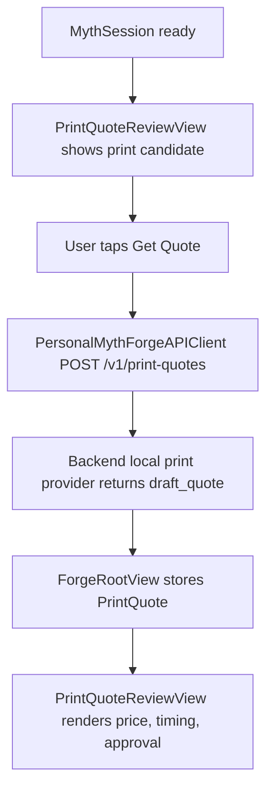

# P0.39 Mobile Print Quote Review Design

## Context

P0.38 added the backend print quote handoff contract:

- `POST /v1/print-quotes`
- `PrintQuoteRequest`
- `PrintQuote`
- local deterministic `draft_quote`
- `print_quote_acceptance` in final acceptance

The iOS app still only displays static `PrintCandidate` notes. A phone demo can
show the generated printable candidate, but it cannot ask the backend for the
quote that P0.38 now guarantees. P0.39 closes that mobile handoff gap without
claiming live Treatstock/Sculpteo fulfillment.

## Goal

Add a SwiftPM-verifiable mobile print quote review path that lets the iOS app
request a backend draft quote for the current myth session's print candidate and
render the result in the scrollable demo.

## Non-Goals

- No live Treatstock, Sculpteo, checkout, payment, or order placement.
- No storage of print quotes in backend session history.
- No changes to `ForgeFlowService` capture-to-myth orchestration.
- No simulator/device deployment, signing changes, Xcode license acceptance, or
  global Xcode configuration.
- No provider keys in the mobile app.

## Alternatives Considered

### Option A: Attach Quote State To `ForgeRootView` Only

The core models and API client know how to encode/decode and request quotes, but
quote loading state lives in `ForgeRootView` as local UI state. The view clears
quote state when a new myth is forged or the local demo snapshot is cleared.

This is the recommended approach. It is small, testable, and keeps the quote as
a review action after a session is ready.

### Option B: Add Quote To `ForgeFlowState`

The reducer would gain quote phases such as `requestingPrintQuote` and
`printQuoteReady`. This makes quote state formally testable through the reducer,
but it mixes a post-forge review action into the capture upload/session creation
state machine.

This is more structure than P0.39 needs.

### Option C: Add Quote To Backend History

The app would only read a quote from server-owned history after the backend
stores it. This is useful later for repeatable payment/order review, but it
requires new persistence semantics and does not help the current local quote
handoff quickly.

This should wait until real print providers exist.

## Chosen Design

Use Option A.

P0.39 adds the mobile contract and view layer:

- `PrintQuoteRequest` and `PrintQuote` Swift models in
  `PersonalMythForgeMobileCore`.
- `PersonalMythForgeAPIClient.createPrintQuote(...)`.
- `PrintQuoteReviewView` in the app layer.
- `ForgeRootView` state for `printQuote`, `isLoadingPrintQuote`, and
  `printQuoteError`.
- A `Get Quote` action shown only when a ready myth session exists.

The mobile app sends the existing `session.printCandidate` plus default local
review preferences:

- `quantity: 1`
- `material: "standard_resin"`
- `finish: "matte"`
- `ship_to_country: "US"`

The quote response renders:

- provider
- status
- currency and estimated price
- production and shipping days
- user approval requirement
- quote notes

The view does not render a checkout action. If a future backend returns a
checkout URL, P0.39 still treats the quote as review-only unless a later
iteration explicitly adds approval/payment flow.

## Data Flow

## API Safety

The mobile request contains no provider API key and no raw capture media. The
client uses the same JSON encoder and HTTP error sanitization rules as other
backend calls. P0.39 adds payment-oriented HTTP error sanitization patterns so
error bodies do not surface `checkout_url=...`, `pay.example/...`, or
`checkout.example/...` values.

## UI Behavior

When no myth session is ready, the print quote view is hidden. The static
print candidate notes already shown in `NPCReactionsView` remain unchanged.

When a myth session is ready:

- `PrintQuoteReviewView` shows candidate format, approval reason, and
  printability notes.
- The primary button says `Get Quote`.
- While loading, the button is disabled and shows `Quoting...`.
- On success, the view displays the draft quote summary.
- On failure, the view displays a compact non-secret error message:
  `Print quote is not reachable yet.`

When the user forges a new myth, clears the demo snapshot, or restores a
different backend history session, P0.39 clears the previous quote so stale
prices are not shown for a new artifact.

## Testing

SwiftPM contract tests cover:

- decoding `PrintQuote`
- encoding `PrintQuoteRequest` with snake_case JSON keys
- `PersonalMythForgeAPIClient.createPrintQuote(...)` builds
  `POST /v1/print-quotes`
- the request body includes the print candidate, quantity, material, finish, and
  shipping country
- HTTP error bodies redact checkout/payment identifiers
- app source contains `PrintQuoteReviewView` wiring and quote-loading state

Existing gates remain:

- `make backend-lint`
- `make backend-test`
- `swift run --package-path apps/mobile/ios PersonalMythForgeMobileProjectChecks`
- `swift run --package-path apps/mobile/ios PersonalMythForgeMobileCoreContractTests`
- `swift build --package-path apps/mobile/ios --product PersonalMythForgeMobileAppCompileCheck`
- `final-acceptance --profile quick --provider-mode local`
- `make mobile-deploy-preflight` expected exit `2` until local signing/LAN URL
  exist
- `make mobile-xcode-build` expected Apple SDK license gate on this machine

## Evidence

P0.39 will add:

- `docs/superpowers/verification/p0.39-mobile-print-quote-review.html`
- `docs/superpowers/verification/assets/p0.39-mobile-print-quote-review-390x844.png`
- `docs/superpowers/verification/2026-06-06-p0.39-mobile-print-quote-review-regression.md`

The evidence page must show a ready myth session, print candidate review, draft
quote status, `USD 16.00`, user approval required, and known live-provider/iOS
deployment gates.
