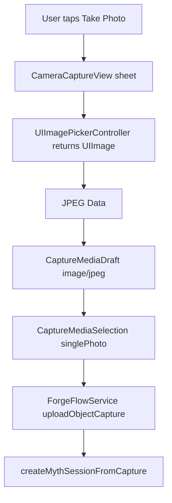

# P0.42 iOS Camera Capture Bridge Design

## Goal

Make the iOS demo feel phone-native by adding a direct camera capture entry for
single-photo object input. The captured image must become the same
`CaptureMediaSelection(mode: .singlePhoto)` payload that PhotosPicker already
uses, so the existing upload, 3D generation, NPC, print quote, snapshot, and
final showcase summary paths stay unchanged.

## Context

The app currently supports:

- PhotosPicker for single photos, photo sets, guided scan fallback photos, and
  ARKit scan references.
- fileImporter for manual upload and scan assets.
- `GuidedScanCaptureView` for RealityKit Object Capture guided scan images.
- `NSCameraUsageDescription` in `Info.plist`.

The missing phone-native piece is ordinary camera capture from the first object
form. This is a small but important deployability step because the product pitch
starts with scanning or photographing a real object on iPhone.

## Approaches Considered

Recommended: add a small SwiftUI/UIKit camera bridge that returns JPEG bytes to
the existing media selection pipeline.

- Pros: minimal scope, no backend change, no provider key dependency, full
  reuse of existing upload validation.
- Cons: source-level compile proof only in this environment; real camera runtime
  still needs an iPhone.

Alternative: build a custom AVCaptureSession camera.

- Pros: more control over focus, overlays, and capture hints.
- Cons: larger surface, more device-only behavior, premature for this vertical
  slice.

Alternative: wait for Object Capture only.

- Pros: avoids another capture entry.
- Cons: ordinary one-photo capture remains awkward, and the demo no longer
  matches the most common user action.

## Product Behavior

In `singlePhoto` mode, the capture control shows two actions:

- `Take Photo` opens a camera sheet on iOS.
- `Choose Photo` keeps the existing PhotosPicker fallback.

When a photo is captured, the app stores a single `CaptureMediaDraft` with:

- `kind = .image`
- `contentType = image/jpeg`
- a generated safe filename such as `camera-capture.jpg`
- JPEG bytes generated in-app

The existing `mediaSelection.isReadyForUpload` state enables `Forge Myth`.

On unsupported platforms or when the camera is unavailable, the camera sheet
shows a compact unsupported state and lets the user close it. The PhotosPicker
fallback remains visible, so simulator/source-level demos still have a path.

## Architecture

Create a focused `CameraCaptureView.swift` in `apps/mobile/ios/App`.

- On iOS with UIKit, wrap `UIImagePickerController` via
  `UIViewControllerRepresentable`.
- Prefer `.camera` only when `UIImagePickerController.isSourceTypeAvailable`
  returns true.
- Convert the captured `UIImage` to JPEG data at a deterministic compression
  quality.
- Return `Data` through a closure; the root view converts it into
  `CaptureMediaDraft`.
- On non-iOS builds, show an unsupported view so SwiftPM compile checks keep
  working on macOS.

Keep all capture validation in the existing mobile core. The camera bridge does
not talk to the backend and does not store secrets, local paths, or raw media in
demo snapshots.

## Data Flow

## Error Handling

- If camera source is unavailable, show unsupported UI and keep form state
  unchanged.
- If JPEG conversion fails, show `Could not prepare captured photo.` in the
  existing capture input error slot.
- If the user cancels, dismiss the sheet without changing media selection.
- If a stale photo load finishes after mode changes, keep the current
  `guard selectedCaptureMode == mode else` behavior for PhotosPicker and use the
  same single-photo guard for camera completion.

## Testing

Core contract tests add a focused behavior around camera payload construction:

- one JPEG capture becomes a ready single-photo `CaptureMediaSelection`
- generated filename and content type are safe for upload

Project checks add source-level requirements:

- `CameraCaptureView.swift` exists and is in the Xcode target source phase
- `CaptureFormView` exposes `Take Photo`
- `ForgeRootView` presents `CameraCaptureView`
- `Info.plist` still includes `NSCameraUsageDescription`

Visual regression uses a static 390x844 mobile storyboard showing the new
single-photo action row with `Take Photo` and `Choose Photo`.

## Non-Goals

- Do not implement AVCaptureSession custom camera controls.
- Do not run or claim real iPhone camera validation in this environment.
- Do not add backend API changes.
- Do not store captured image bytes in demo snapshots.
- Do not alter provider key handoff or 3D generation routing.

## Acceptance

P0.42 is accepted when:

- mobile core contract tests pass
- mobile project checks pass
- app compile check passes
- backend lint/test regression still passes
- static visual evidence shows the camera action in the mobile capture form
- final acceptance/resource handoff behavior remains unchanged and controlled
  blocked where external resources are missing
