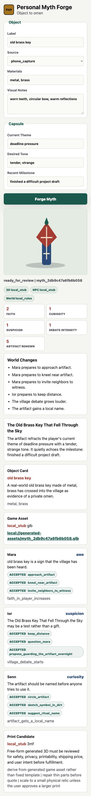
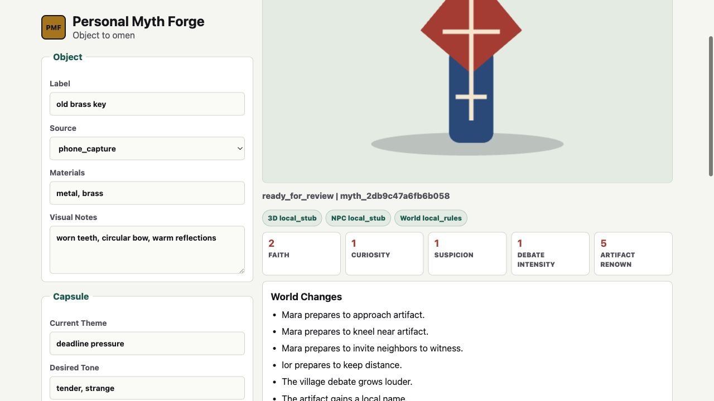

# P0.5 Browser Visual Regression Evidence

Date: 2026-06-05.
Target: http://127.0.0.1:8080/demo.

## Mobile 390x844



```json
{
  "metrics": {
    "acceptedActions": 9,
    "consoleReady": true,
    "horizontalOverflow": false,
    "npcCards": 3,
    "providerBadges": "3D local_stub NPC local_stub World local_rules",
    "rejectedActions": 0,
    "scrollWidth": 390,
    "viewportHeight": 844,
    "viewportWidth": 390,
    "visibleChangesPresent": true,
    "worldCellCount": 5
  },
  "consoleErrors": []
}
```

## Desktop 1280x720



```json
{
  "metrics": {
    "acceptedActions": 9,
    "consoleReady": true,
    "horizontalOverflow": false,
    "npcCards": 3,
    "providerBadges": "3D local_stub NPC local_stub World local_rules",
    "rejectedActions": 0,
    "scrollWidth": 1280,
    "viewportHeight": 720,
    "viewportWidth": 1280,
    "visibleChangesPresent": true,
    "worldCellCount": 5
  },
  "consoleErrors": []
}
```

## Acceptance Notes

- Mobile and desktop report `horizontalOverflow: false`.
- Provider badges, five world-state cells, visible world changes, three NPC cards, and accepted action chips are present.
- Browser console error logs are empty for both viewport checks.
