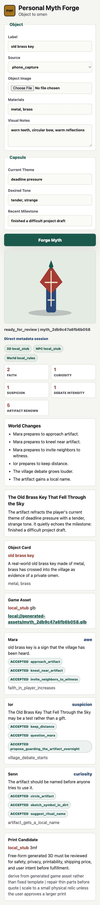
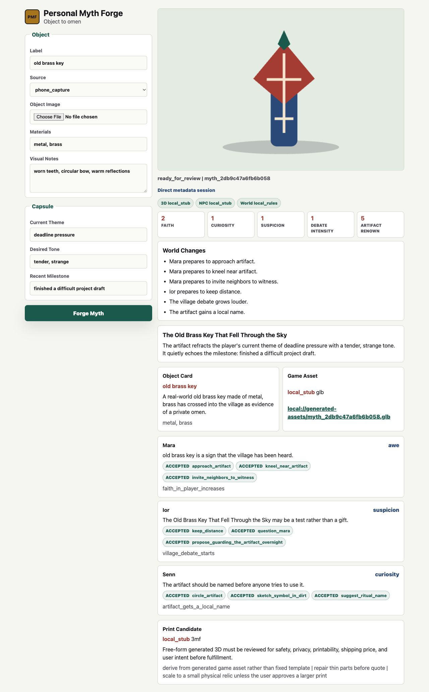

# P0.6 Browser Capture Regression Evidence

Date: 2026-06-05.
Target: http://127.0.0.1:8080/demo.

The Browser plugin exposes the upload input and visual flow, but its documented
Playwright subset does not expose file chooser or `setInputFiles` support. Browser
coverage therefore verifies the visible upload mount point, direct no-file demo
session path, layout, world state, NPC cards, and console errors. The real
multipart capture upload path was verified separately against the same running
local backend with `curl`.

## Mobile 390x844



Metrics:

```json
{
  "horizontalOverflow": false,
  "captureStatusVisible": true,
  "captureStatusText": "Direct metadata session",
  "fileInputVisible": true,
  "providerBadges": 3,
  "worldCellCount": 5,
  "visibleChangesItems": 6,
  "npcCards": 3,
  "actionChips": 9,
  "consoleErrors": []
}
```

## Desktop 1280x720



Metrics:

```json
{
  "horizontalOverflow": false,
  "captureStatusVisible": true,
  "captureStatusText": "Direct metadata session",
  "fileInputVisible": true,
  "providerBadges": 3,
  "worldCellCount": 5,
  "visibleChangesItems": 6,
  "npcCards": 3,
  "actionChips": 9,
  "consoleErrors": []
}
```

## Multipart Capture API

`curl` uploaded `apps/mobile/fixtures/object-capture-metadata.json` as a local
`image/jpeg` fixture, then created a myth session from the returned capture id.

```json
{
  "capture_id": "cap_ba02a3816bd145b4",
  "media_count": 1,
  "media_uri": "local-capture://cap_ba02a3816bd145b4/media_0.jpg",
  "manifest_in_backend_local": true,
  "media_in_backend_local": true,
  "session_status": "ready_for_review",
  "object_affordances": [
    "can be approached as a old brass key",
    "can become a ritual focus",
    "can alter local belief when witnessed by NPCs",
    "can symbolize endurance, locks, oaths, or hidden passages",
    "uploaded capture media"
  ],
  "generated_asset_provider": "local_stub"
}
```
