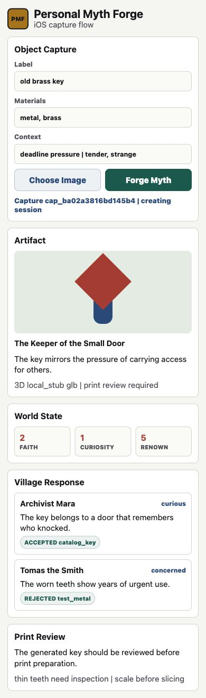

# P0.7 iOS Flow Storyboard Visual Regression

Date: 2026-06-05

This is storyboard evidence for the P0.7 mobile client scaffold. It is not
simulator or device evidence. The local environment has SwiftPM available but
does not have full Xcode selected, so P0.7 verifies the mobile contract through
Swift executable tests and this static mobile storyboard.

Codex Browser blocked direct `file://` navigation by URL policy, so the same
repo-local HTML was served through a temporary `127.0.0.1` static server scoped
to `docs/superpowers/verification`.

## Screenshot



## Browser Check

- URL: `http://127.0.0.1:8127/p0.7-ios-flow.html`
- Viewport: `390x844`
- Console errors: `[]`
- Horizontal overflow: `false`
- Capture form visible: `true`
- Artifact summary visible: `true`
- World state visible: `true`
- NPC section visible: `true`
- Print review visible: `true`

```json
{
  "viewport": {
    "width": 390,
    "height": 844
  },
  "document": {
    "clientWidth": 390,
    "scrollWidth": 390,
    "scrollHeight": 1319
  },
  "horizontalOverflow": false,
  "captureFormVisible": true,
  "artifactSummaryVisible": true,
  "worldStateVisible": true,
  "npcSectionVisible": true,
  "printReviewVisible": true,
  "sections": {
    "captureForm": {
      "x": 14,
      "y": 69,
      "width": 362,
      "height": 350
    },
    "artifactSummary": {
      "x": 14,
      "y": 430,
      "width": 362,
      "height": 320
    },
    "worldState": {
      "x": 14,
      "y": 763,
      "width": 362,
      "height": 113
    },
    "npcReactions": {
      "x": 14,
      "y": 888,
      "width": 362,
      "height": 279
    },
    "printReview": {
      "x": 14,
      "y": 1179,
      "width": 362,
      "height": 126
    }
  }
}
```
